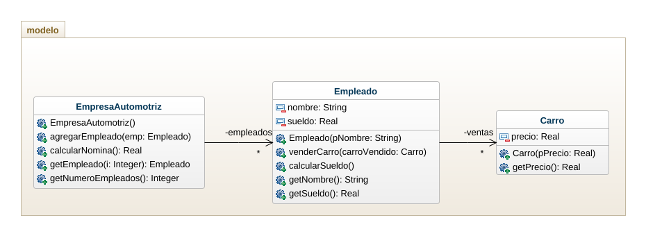
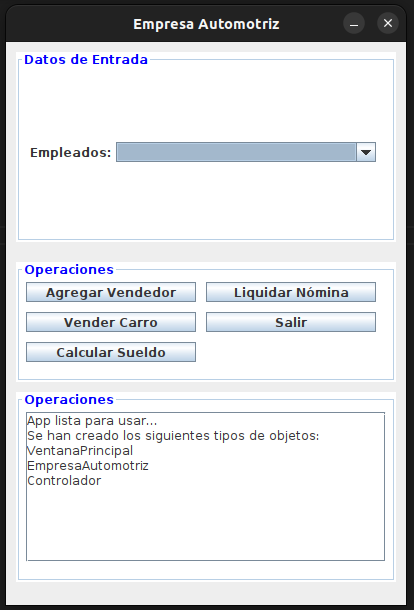

# EmpresaAutomotriz2

El sueldo que perciben los vendedores de una empresa automotriz está integrado de la siguiente manera:
- Salario mínimo
- $100000 por cada carro vendido
- 2% del valor de los autos vendidos

Se tienen varios vendedores, y por cada vendedor se tiene el nombre y el precio de cada carro que vendió en el mes.  Es posible que algunos vendedores no hayan realizado venta alguna; en tal caso sólo se tendrá el nombre.

Elaborar un programa que permita leer los datos e imprimir el reporte de nómina mensual.

## Diagrama de Clases

## vista

